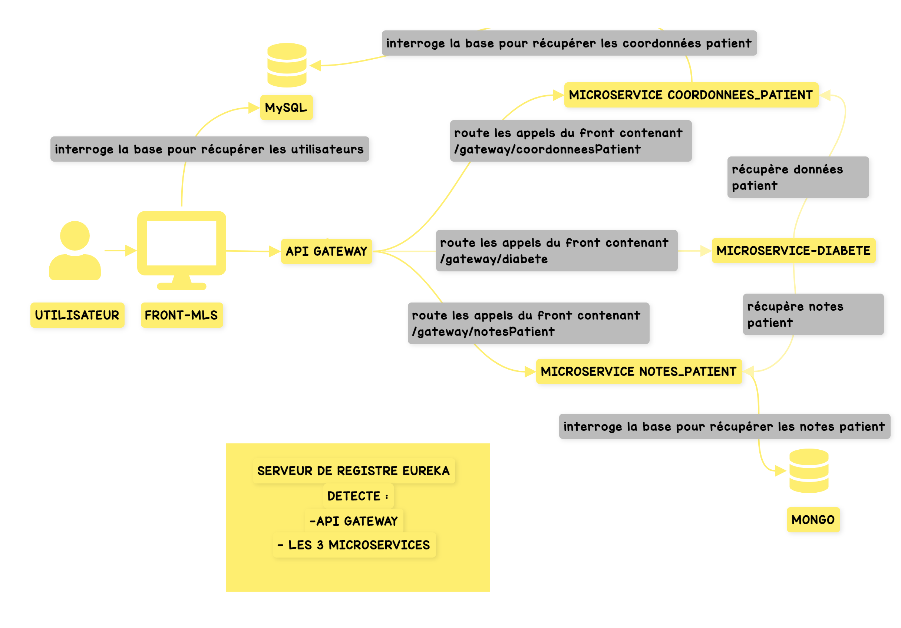

#  Projet 9 : MediLabo Solutions (MLS) - PM

Le projet MédiLabo Solutions fournit des informations sur les patients par rapport à leur risque de diabète.
Le projet est organisé avec plusieurs microservices qui communiquent entre eux :
>- **front-mls** : qui représente le front avec ne base de données mysql qui stocke les users
>- **mls-coordonnees-patient** : qui représente un service back-end qui renvoie les coordonnées des patients. 
>Les données sont stockées dans une base de données mysql partagée avec le service front pour respecter certains principes du green code.
>- **mls-notes-patient** : qui représente un service back-end qui renvoie les notes du praticien sur le patient
>- **mls-gateway** : qui est la gateway protégeant les appels aux services back-end. Le front n'appellera pas directement les services back.
>- **eureka-server** : qui est un edge microservice représentant un server de registre détectant les microservices et leur état une fois déclaré en tant que client.

## Pré-requis

Les données injectées dans la base de données mysql sont présentes [ici](./front-mls/data/data.sql).
Pour la partie container, les bases de données mysql et plus tard mongo auront des volumes pour persister les données.

## Architecture du projet

Voici le schéma de fonctionnement de l'application :

## Déploiement du projet 

- Vous devez avoir Docker Desktop installer sur votre poste pour pouvoir lancer tous les conteneurs via la commande : `docker compose up -d` (commande à lancer depuis le dossier où se trouver le ficher doceker-compose.yml)
- Les bases de données Mongo et MySql sse trouvent sur des conteneurs avec des volumes pour persister les données cependant pour un utilisateur qui ne dispose pas des volumes que j'ai montés, il vous faudra ajouter le user **mls** sur la base mongo et la base MySql
- Il faut créer un user qui aura accès aux 2 schémas mls_coordonnees et mls côté MySql et au schéma mls côté Mongo
- Pour arriver au sein du conteneur sur le terminal bash une fois celui-ci démarré , il faut passer la commande : `docker exec -it <nom_du_conteneur bash` puis vous pourrez passer vos commandes mongosh ou mysql -umls -p pour accéder aux bases et schémas
- Pour MySql, les scripts à insérer pour avoir des utilisateurs avec des structures sont [ici](./front-mls/data/data.sql).
- Pour MongoDb, des exemples de commande pour se connecter ou insérer les données sont [ici](./front-mls/data/mongo_scripts.txt).
- **N.B**: _ne pas oublier que les autres conteneurs doivent avoir accès aux datas donc pour MySql, il faudra un grant sur 'mls'@'%'_

## Green code

- Utilisation de [squoosh](https://squoosh.app/) pour mettre les images au format webp et les compresser au maximum :
  - passage au format webp
  - gain sur la taille de l'image : 154 ko à 6 ko
- Utilisation de la pagination pour de meilleurs temps de réponse ce qui constitue une bonne pratique de Green IT
- Partage du serveur de base de données _**MySQL**_ avec deux schémas :
  - un schéma **mls** qui contient la tables des utilisateurs de l'application et la table des structures associées aux utilisateurs et qui est liée au service front **front-mls**
  - un schéma **mls_coordonnees** qui contient les données des coordonnées des patients et qui est liée au service back-end **mls-coordonnees-patient**

>Ressources eco-conception : https://ecoresponsable.numerique.gouv.fr/thematiques/evaluation/